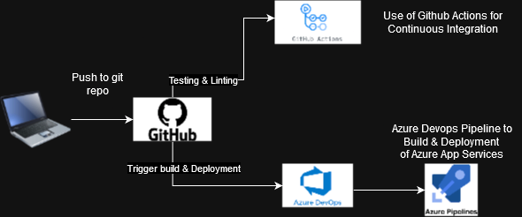
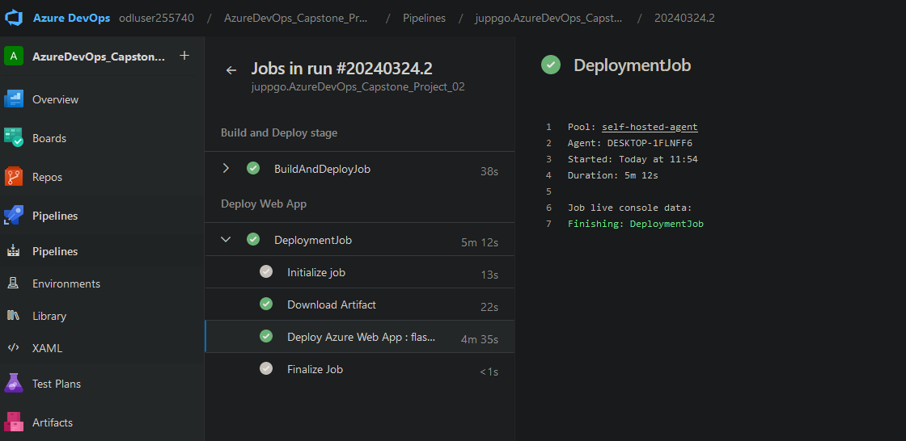

# Overview

This repository guides you through setting up a robust Continuous Integration and Continuous Delivery pipeline using GitHub Actions and Azure DevOps. By following the steps outlined here, you'll establish a seamless workflow for linting, testing, building, and deploying a python Machine learning application for housing price predictions to Azure App Service.

## Project Plan
<TODO: Project Plan

* link to a Trello board for the project: https://trello.com/invite/b/Z1Xqh4GZ/ATTI87e9339f9c90f6fd330cdede91e790860D9683A4/azuredevops-capstone02
* A link to a spreadsheet that includes the original and final project plan:

## Instructions

<TODO:  Instructions for running the Python project.  How could a user with no context run this project without asking you for any help.  Include screenshots with explicit steps to create that work. Be sure to at least include the following screenshots:

1. Open Azure Cloud Shell and clone repository from github: `git clone https://github.com/juppgo/AzureDevOps_Capstone_Project_02.git`

2. cd into the project `cd AzureDevOps_Capstone_Project_02`

Run Github Actions:

1. cd into Part_01 directory `cd Part01`

2. Create and activate python venv: 

`python3 -m venv ~/.Part_01`
`source ~/.Part_01/bin/activate`

3. Run Make commands:

`make all`

Setup Azure App Service

3. Create the python virtual environment: 
`python3 -m venv ~/.AzureDevOps_Capstone_Project_02`
`source ~/.AzureDevOps_Capstone_Project_02/bin/activate`

4. run make commands:

`make install`

`make all`

5. run az cli command to create Azure App Service from cloud shell:

`az webapp up --name flask-appservice-<youruniqueID> --resource-group Azuredevops --runtime "PYTHON:3.10"`

6. Run make_predict_azure_app.sh

`chmod +x make_predict_azure_app.sh`
`./make_predict_azure_app.sh`

7. Run pytest 

`python -m pytest -vv test.py`

8. You can stream the log data via the cloud shell: `az webapp log tail`

- Load Test Application with Locust

1. Create and activate python venv

`python3 -m venv .locust`
`source .locust/bin/activate`

2. Install Locust

`source .locust/bin/activate`
`pip install locust`

3. Run locust

`locust --headless --users 1 --spawn-rate 1 -H https://flask-appservice-2024032401.azurewebsites.net.azurewebsites.net`

Azure Devops:

Due to restrictions in Azure DevOps (Pipeline runs will fail - due to no parallelism of the lab environment) it is recommended to setup a self-hosted agent running on your local machine.

1. Download the agent
`https://vstsagentpackage.azureedge.net/agent/3.236.1/vsts-agent-win-x64-3.236.1.zip`

2. Create the agent

`PS C:\> mkdir agent
PS C:\> cd agent
PS C:\agent> Add-Type -AssemblyName System.IO.Compression.FileSystem ; [System.IO.Compression.ZipFile]::ExtractToDirectory("$HOME\Downloads\vsts-agent-win-x64-3.236.1.zip", "$PWD")`

3. Configure the agent
`PS C:\agent> .\config.cmd`
Detailed instructions: `https://go.microsoft.com/fwlink/?LinkID=825113`

4. Run the agent:
`PS C:\agent> .\run.cmd`

* Running Azure App Service from Azure Pipelines automatic deployment

1. Create Service connection. Go to project settings. Click on Create service connection. Choose Azure Resource Manager and Service principal (automatic):

2. Retrieve service connection resource id from service connection url:

3. Edit pipeline line 11 and change the service connection id:

4. Click on validate and save pipeline.

5. Check pipeline run:

## Enhancements

- Create a dockerfile to run application on managed PAAS services like Azure Container Apps on Azure
- Create a helm chart to run application on AKS

## Demo 

<TODO: Add link Screencast on YouTube>

