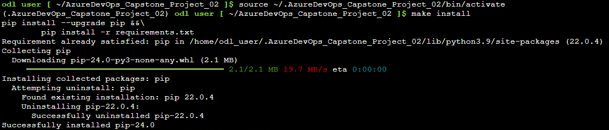
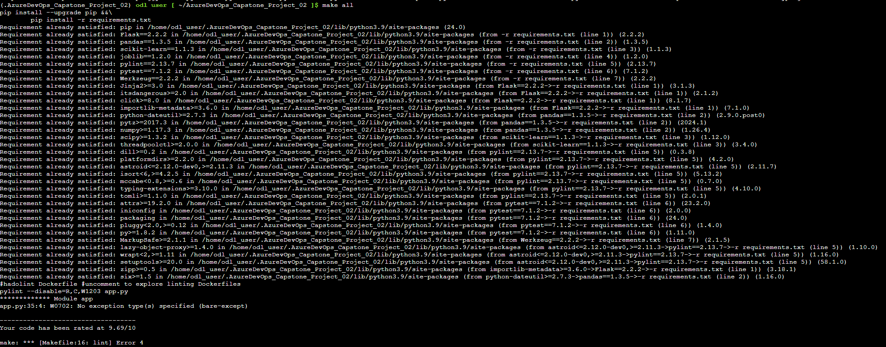

# Overview

<TODO: complete this with an overview of your project>

## Project Plan
<TODO: Project Plan

* A link to a Trello board for the project
* A link to a spreadsheet that includes the original and final project plan>

## Instructions

<TODO:  
* Architectural Diagram (Shows how key parts of the system work)>

<TODO:  Instructions for running the Python project.  How could a user with no context run this project without asking you for any help.  Include screenshots with explicit steps to create that work. Be sure to at least include the following screenshots:


1. Open Azure Cloud Shell and clone repository from github: `git clone https://github.com/juppgo/AzureDevOps_Capstone_Project_02.git`


2. cd into the project `cd AzureDevOps_Capstone_Project_02`


Run Github Actions:

1. cd into Part_01 directory `cd Part01`

2. Create and activate python venv: 

`python3 -m venv ~/.Part_01`
`source ~/.Part_01/bin/activate`

3. Run Make commands:

`make all`
`make test`

Setup Azure App Service

3. Create the python virtual environment: 
`python3 -m venv ~/.AzureDevOps_Capstone_Project_02`
`source ~/.AzureDevOps_Capstone_Project_02/bin/activate`


4. run make commands:

`make install`



`make all`



5. run az cli command to create Azure App Service from cloud shell:

`az webapp up --name flask-appservice-<youruniqueID> --resource-group Azuredevops --runtime "PYTHON:3.10"`


6. Run make_predict_azure_app.sh

`chmod +x make_predict_azure_app.sh`
`./make_predict_azure_app.sh`


7. Run pytest 

`python -m pytest -vv test.py`


8. You can stream the log data via the cloud shell: `az webapp log tail`


- Load Test Application with Locust

1. Create and activate python venv

`python3 -m venv .locust`
`source .locust/bin/activate`

2. Install Locust

`source .locust/bin/activate`
`pip install locust`

3. Run locust

`locust --headless --users 1 --spawn-rate 1 -H https://flask-appservice-2024032401.azurewebsites.net.azurewebsites.net`


* Project running on Azure App Service

* Project cloned into Azure Cloud Shell

* Passing tests that are displayed after running the `make all` command from the `Makefile`

* Output of a test run

* Successful deploy of the project in Azure Pipelines.  [Note the official documentation should be referred to and double checked as you setup CI/CD](https://docs.microsoft.com/en-us/azure/devops/pipelines/ecosystems/python-webapp?view=azure-devops).

* Running Azure App Service from Azure Pipelines automatic deployment

* Successful prediction from deployed flask app in Azure Cloud Shell.  [Use this file as a template for the deployed prediction](https://github.com/udacity/nd082-Azure-Cloud-DevOps-Starter-Code/blob/master/C2-AgileDevelopmentwithAzure/project/starter_files/flask-sklearn/make_predict_azure_app.sh).
The output should look similar to this:

```bash
udacity@Azure:~$ ./make_predict_azure_app.sh
Port: 443
{"prediction":[20.35373177134412]}
```

* Output of streamed log files from deployed application

> 

## Enhancements

<TODO: A short description of how to improve the project in the future>

## Demo 

<TODO: Add link Screencast on YouTube>


